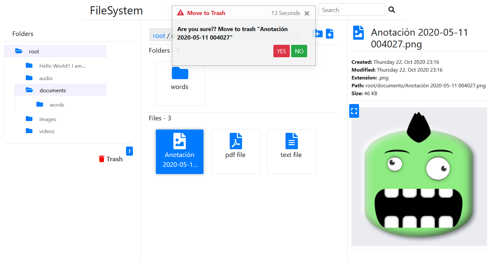

# File System - PHP

Practice handling files with **PHP** (and HTML5, CSS3, JavaScript, jQuery, Bootstrap)

## Objectives

The main objective of this practice is to manage files with PHP and achieve the style proposed in the wireframes (wireframes folder).

***Implemented:***

- Create folder tree
- Create folders.
- Upload files.
- Delete files.
- Rename files and folders.
- Search files/folders.
- Trash folder.
- Display images and videos preview (and maximize).
- Display audio player.
- Show file/folrder information.
- Show confirmation window before deleting file/folder.
- Show messages when uploading, renaming and deleting file.
- Diplay context menu.

***Pending:***

- Display text files preview and .csv files (excel).
- Move file/folder to another location.
- Recover file/folder from trash folder.

## Author

Ezequiel Garay [https://github.com/ezemgaray](GitHub)